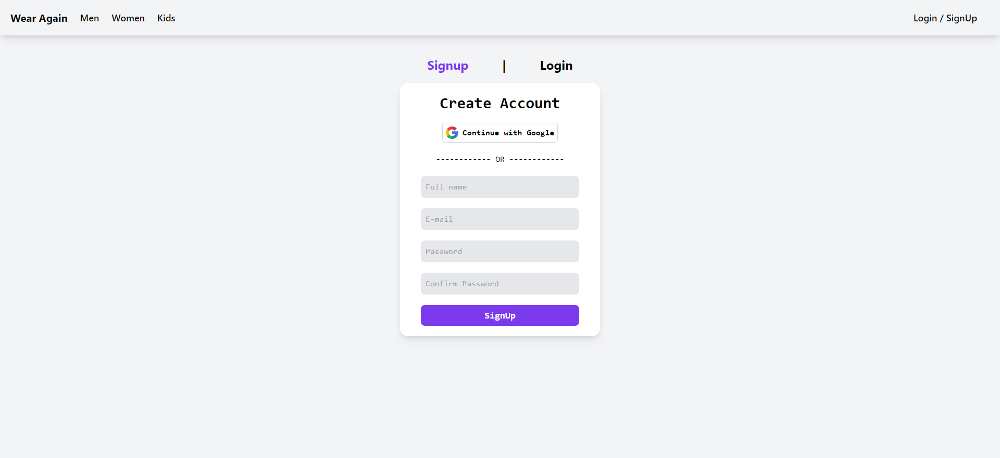
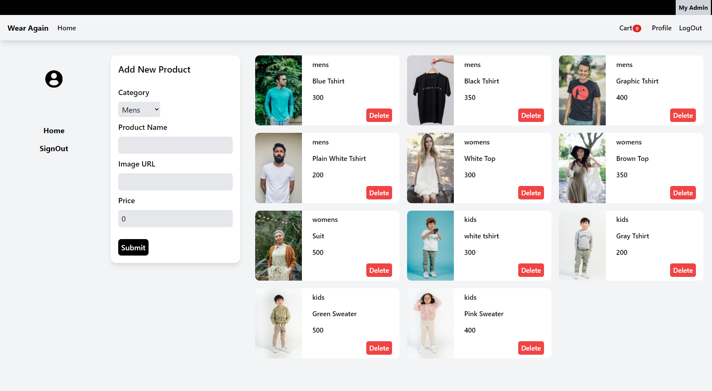
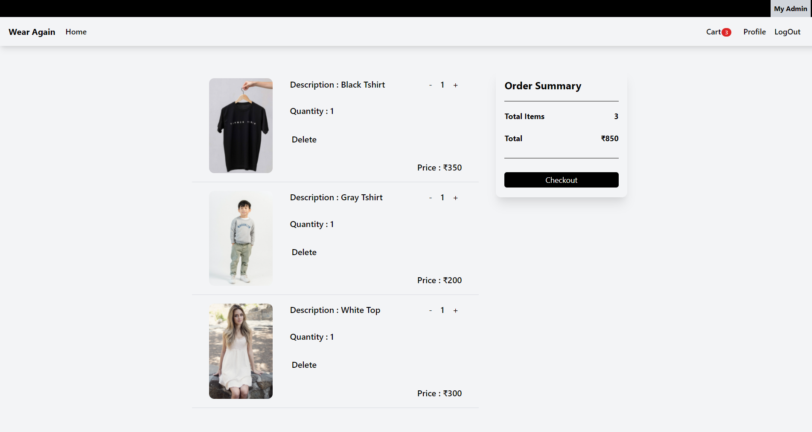
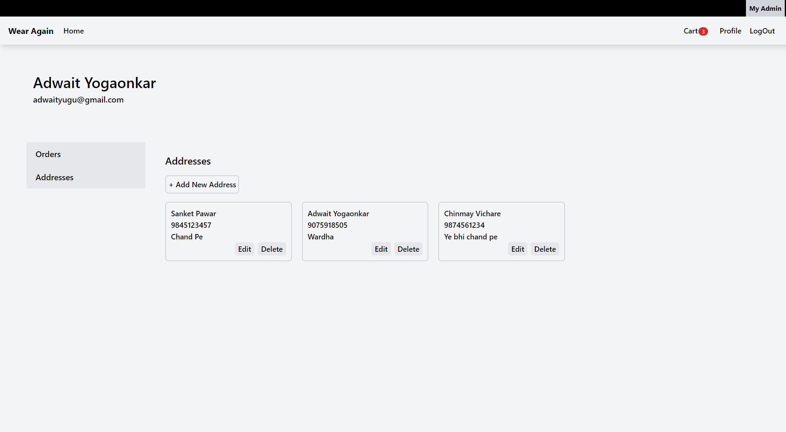
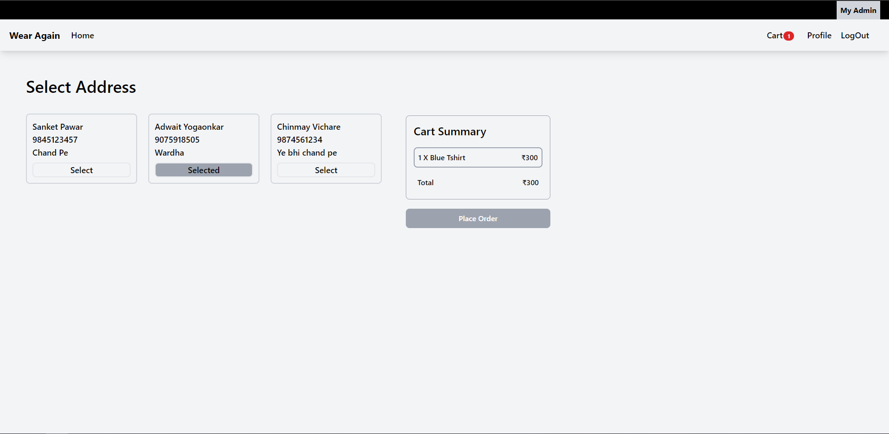
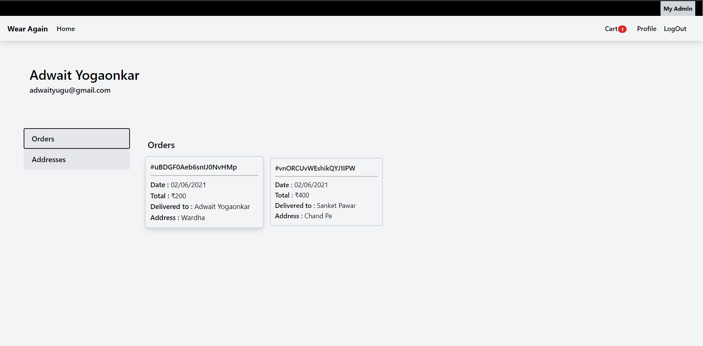
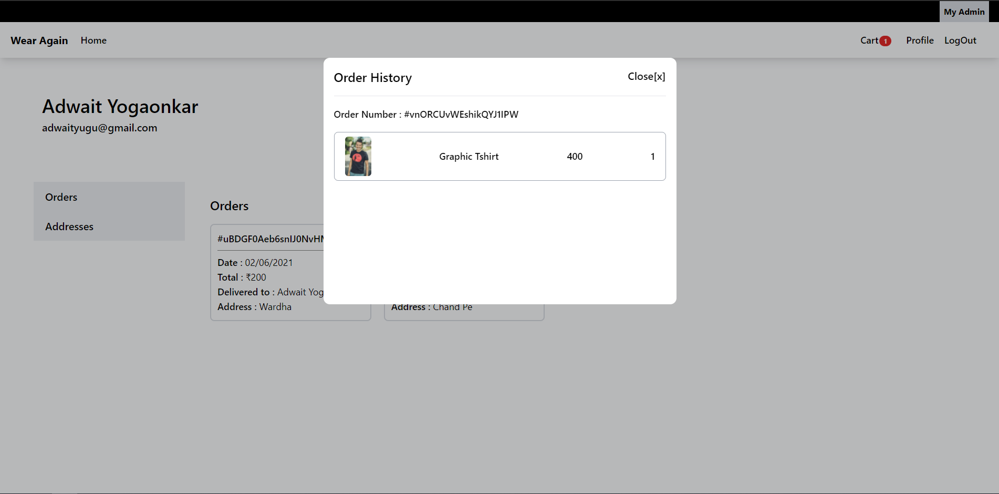

# WearAgain (OnGoing)

## An E-Commerce website where users can customize their Clothings with different images, texts and Colors.

---

**NOTE : Make a firebase config file with your credentials as _config.js_ and insert in ./src/firebase/ **

### ScreenShots

**Landing Page**

**Login**

**Register**

**HomePage / Categories**

**AdminPanel**

**Cart**

**UserProfile**

**Payment Confirmation**

**Order History**

**Order Details**

